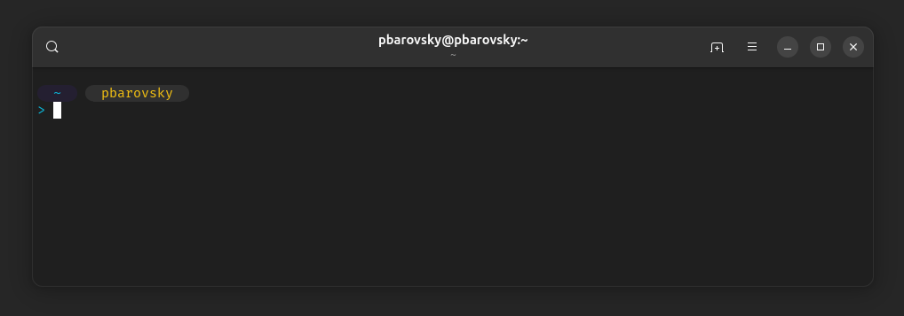

# pbsegments - A Custom Zsh Theme

**pbsegments** is a minimal and visually appealing custom theme for [Oh My Zsh](https://ohmyz.sh/). It features a clean, segment-based prompt with Git integration, optimized for readability and usability.

---

## Screenshots

**With Git Repository:**  


**Without Git Repository:**  


---

## Features
- Displays the current working directory
- Shows the username
- Indicates Git branch and status
- Custom symbols for better visual separation
- Keeps the input area clean with `>` on a new line

---

## Installation

1. Clone or download the `pbsegments.zsh-theme` file into your custom themes directory:
   ```sh
   cp pbsegments.zsh-theme ~/.oh-my-zsh/custom/themes/
   ```

2. Open your `~/.zshrc` file and set the theme:
   ```sh
   ZSH_THEME="pbsegments"
   ```

3. Apply changes by restarting the terminal or running:
   ```sh
   source ~/.zshrc
   ```

---

## Customization

You can modify colors, symbols, and segment behavior by editing the `pbsegments.zsh-theme` file. Adjust colors to match your preferred terminal scheme.

---

Enjoy your personalized terminal experience with **pbsegments**!
